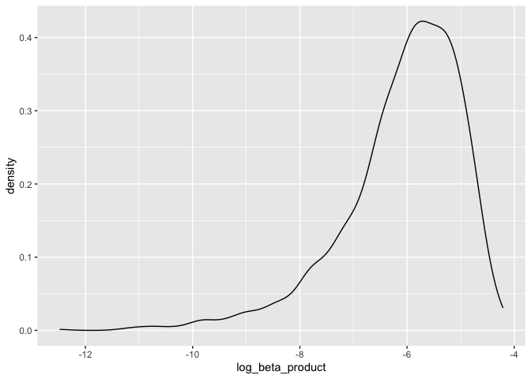
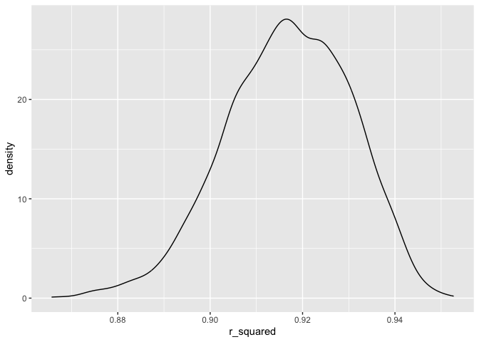
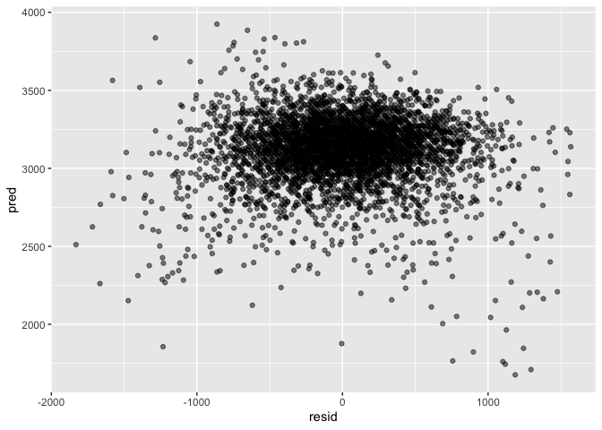

p8108_hw6_vas2145
================
Victoria Schliep
2023-12-02

\#loading libraries

``` r
library(tidyverse)
```

    ## ── Attaching core tidyverse packages ──────────────────────── tidyverse 2.0.0 ──
    ## ✔ dplyr     1.1.3     ✔ readr     2.1.4
    ## ✔ forcats   1.0.0     ✔ stringr   1.5.0
    ## ✔ ggplot2   3.4.3     ✔ tibble    3.2.1
    ## ✔ lubridate 1.9.2     ✔ tidyr     1.3.0
    ## ✔ purrr     1.0.2     
    ## ── Conflicts ────────────────────────────────────────── tidyverse_conflicts() ──
    ## ✖ dplyr::filter() masks stats::filter()
    ## ✖ dplyr::lag()    masks stats::lag()
    ## ℹ Use the conflicted package (<http://conflicted.r-lib.org/>) to force all conflicts to become errors

``` r
library(modelr)
library(mgcv)
```

    ## Loading required package: nlme
    ## 
    ## Attaching package: 'nlme'
    ## 
    ## The following object is masked from 'package:dplyr':
    ## 
    ##     collapse
    ## 
    ## This is mgcv 1.9-0. For overview type 'help("mgcv-package")'.

``` r
library(dplyr)
library(knitr)
set.seed(1)
```

\#problem 2 \#download provided data

``` r
weather_df = 
  rnoaa::meteo_pull_monitors(
    c("USW00094728"),
    var = c("PRCP", "TMIN", "TMAX"), 
    date_min = "2022-01-01",
    date_max = "2022-12-31") |>
  mutate(
    name = recode(id, USW00094728 = "CentralPark_NY"),
    tmin = tmin / 10,
    tmax = tmax / 10) |>
  select(name, id, everything())
```

    ## using cached file: /Users/victoriaschliep/Library/Caches/org.R-project.R/R/rnoaa/noaa_ghcnd/USW00094728.dly

    ## date created (size, mb): 2023-10-03 16:30:07.135344 (8.525)

    ## file min/max dates: 1869-01-01 / 2023-09-30

\#create 5,000 bootstrap samples

``` r
bootstrap_df = weather_df |> 
  modelr::bootstrap(n = 5000) |> 
  mutate(
    models = map(strap, \(df) lm(tmax ~ tmin + prcp, data = df)),
    results = map(models, broom::tidy),
    rsq = map(models, broom::glance)) |> 
  select(results, .id, rsq) |> 
  unnest(results) |> 
  filter(term %in% c("tmin", "prcp")) |> 
  group_by(.id) |> 
  mutate(beta1xbeta2 = prod(estimate),
         log_beta_product = log(beta1xbeta2)) |> 
  select(log_beta_product, rsq) |> 
  unnest(rsq) |> 
  janitor::clean_names() |> 
  select(log_beta_product, id, r_squared) |> 
  unique()
```

    ## Warning: There were 3361 warnings in `mutate()`.
    ## The first warning was:
    ## ℹ In argument: `log_beta_product = log(beta1xbeta2)`.
    ## ℹ In group 2: `.id = "0002"`.
    ## Caused by warning in `log()`:
    ## ! NaNs produced
    ## ℹ Run `dplyr::last_dplyr_warnings()` to see the 3360 remaining warnings.

    ## Adding missing grouping variables: `.id`

\#Plot the distribution of estimates

``` r
bootstrap_df |> 
  ggplot(aes(x = log_beta_product)) +
  geom_density()
```

    ## Warning: Removed 3361 rows containing non-finite values (`stat_density()`).

<!-- -->

The plot of the distribution estimates is a single peak (unimodal) plot
with a peak at approximately -6.25 log of the beta product and at 0.4
density. It is a left skewed distribution.

``` r
bootstrap_df |> 
  ggplot(aes(x = r_squared)) + geom_density()
```

<!-- -->

The plot depicts the distribution estimates of the r-squared value. It
is a unimodal plot with a peak at approximately 0.90 r_squared and 28
density.

``` r
bootstrap_ci = bootstrap_df |> 
  unique() |>
  ungroup() |> 
  select(-id) |> 
  summarize(beta_mean = mean(log_beta_product, na.rm = TRUE),
            beta_high = quantile(log_beta_product, 0.975, na.rm = TRUE),
            beta_low = quantile(log_beta_product, 0.025, na.rm = TRUE),
            rs_mean = mean(r_squared),
            rs_high = quantile(r_squared, 0.975),
            rs_low = quantile(r_squared, 0.025))

bootstrap_ci |> knitr::kable()
```

| beta_mean | beta_high |  beta_low |   rs_mean |   rs_high |    rs_low |
|----------:|----------:|----------:|----------:|----------:|----------:|
| -6.089813 | -4.601673 | -8.981559 | 0.9168349 | 0.9406812 | 0.8885495 |

The 95% confidence interval for the log of the beta product is
(-8.9815594, -4.6016727).

The 95% confidence interval for r-squared is (0.8885495, 0.9406812).

\#Problem 3

Download data

``` r
bwt_df = read.csv("birthweight.csv")

bwt_df = bwt_df |> 
  janitor::clean_names() |> 
  mutate(
    babysex = as.factor(babysex),
    frace = as.factor(frace),
    malform = as.factor(malform),
    mrace = as.factor(mrace)) |> 
  drop_na()
```

Create a regression model

``` r
fit = lm(bwt ~ fincome + gaweeks + smoken, data = bwt_df)

fit |>
  broom::tidy() |>
  select(term, estimate, p.value) |>
  knitr::kable(digits=3)
```

| term        | estimate | p.value |
|:------------|---------:|--------:|
| (Intercept) |  459.170 |       0 |
| fincome     |    2.353 |       0 |
| gaweeks     |   65.438 |       0 |
| smoken      |   -6.881 |       0 |

``` r
summary(fit)
```

    ## 
    ## Call:
    ## lm(formula = bwt ~ fincome + gaweeks + smoken, data = bwt_df)
    ## 
    ## Residuals:
    ##      Min       1Q   Median       3Q      Max 
    ## -1830.77  -287.29    -2.34   288.81  1567.83 
    ## 
    ## Coefficients:
    ##             Estimate Std. Error t value Pr(>|t|)    
    ## (Intercept) 459.1704    87.6724   5.237 1.71e-07 ***
    ## fincome       2.3528     0.2714   8.670  < 2e-16 ***
    ## gaweeks      65.4382     2.2292  29.355  < 2e-16 ***
    ## smoken       -6.8811     0.9468  -7.268 4.31e-13 ***
    ## ---
    ## Signif. codes:  0 '***' 0.001 '**' 0.01 '*' 0.05 '.' 0.1 ' ' 1
    ## 
    ## Residual standard error: 460.5 on 4338 degrees of freedom
    ## Multiple R-squared:  0.1921, Adjusted R-squared:  0.1915 
    ## F-statistic: 343.8 on 3 and 4338 DF,  p-value: < 2.2e-16

The regression model is based on key factors that I believe may have an
influence on a child’s birthweight, the family’s monthly income
(`fincome`), the gestational weeks in age0 (`gaweeks`) and the average
number of cigarettes smoked per day in pregnancy (`smoken`). Because the
p-values are all less than 0.01, none need to be removed from the model.

``` r
bwt_df |> 
  modelr::add_residuals(fit) |> 
  modelr::add_predictions(fit) |> 
  ggplot(aes(x = resid, y = pred)) +
  geom_point(alpha = 0.5)
```

<!-- -->
